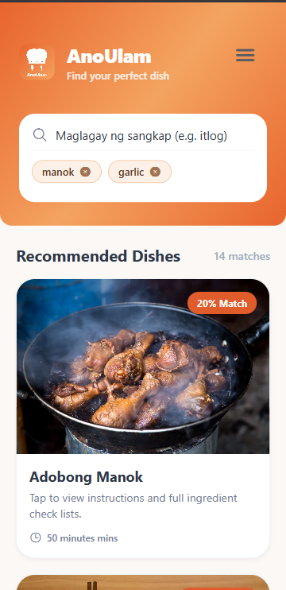
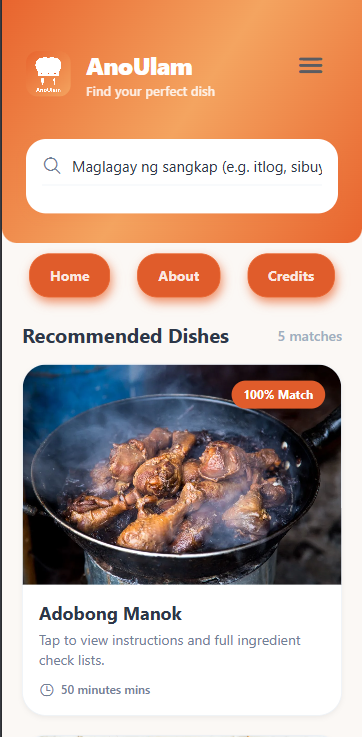
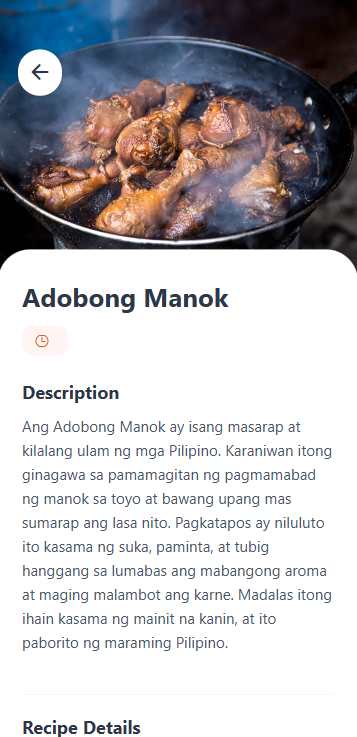
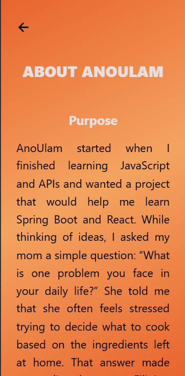
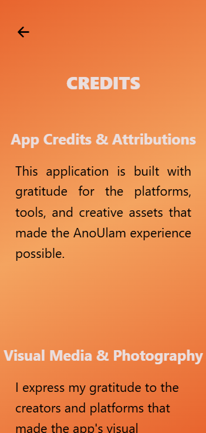

# AnoUlam - Frontend Mobile App

- AnoUlam is a mobile application built to solve a real, everyday family struggle: deciding what to cook based on the ingredients left at home. Born out of a desire to reduce daily stress for home cooks, AnoUlam helps users minimize food waste and discover delicious Filipino dishes with what they already have in their pantry. Simplifying home cooking, one recipe at a time.
- AnoUlam Frontend concentrates on the logic of the application's user interface and its backend connectivity. Based on a kitchen colour scheme, AnoUlam UI offers a sleek, contemporary appearance.

## Key Features
**Ingredient-Based Search** The user enters the ingredients they have at home, and the app recommends the best Filipino recipe that matches their ingredients.
**UI Design** App provides a trendy kitchen theme design, which will increase user motivation to create dishes.
**Dishes specifications** The user can open the dish they like, and the app will give the full specifications of the dish, including its instructions, cooking time, and full ingredients. 


## Screenshots

| Home Screen | Menu Screen | Dish Discovery | About Screen | Credits Screen |
| :---: | :---: | :---: | :---: | :---: |
|  |  |  |  |  |

## 🏗️ Architecture

```text
User
  ↓
React Native Mobile App
  ↓
Spring Boot REST API
  ↓
Aiven MySQL Database
```

---

## 🛠️ Tech Stack

### Frontend

- React Native
- Expo
- JavaScript
- Axios

### Backend

- Spring Boot
- Java
- REST API

### Database

- MySQL
- Aiven Cloud Database

---


## 🚀 Installation

### Clone Repository

```bash
git clone https://github.com/yourusername/anoulam-frontend.git
```

### Install Dependencies

```bash
npm install
```

### Create Environment Variables

Create a `.env` file:

```env
EXPO_PUBLIC_API_URL=YOUR_BACKEND_URL
```

### Start Application

```bash
npx expo start
```

---

## 📂 Project Structure

```text
src/
├── api/
├── components/
├── navigation/
├── screens/
├── services/
└── assets/
```

---

## 🎯 Future Features

- Favorites
- User ratings
- Most searched dishes
- Offline support
- Personalized recommendations

---

## 📚 Lessons Learned

Through this project, I learned:

- React Native development
- Mobile UI design
- API integration
- Environment configuration
- Error handling
- State management
- Full-stack application development

---

## 🔗 Related Repository

Backend Repository:

https://github.com/yourusername/anoulam-backend

---

## 👨‍💻 Developer

Developed by Jude

Built with the goal of helping Filipino families discover meals more easily while learning modern full-stack software development.


